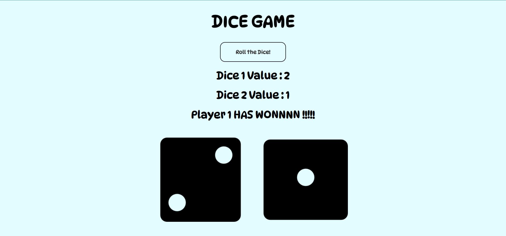

# DICE GAME

Developed a simple dice game using HTML, CSS and Javascript. It is a two player game.

## Built With

➡ HTML

➡ CSS

➡ Javascript

## Working

- The game is a two player dice game
- Two dice are rolled and the player having higher value wins
- If both the values are the same, it is a tie
- The values are randomly chosen

## GUI

